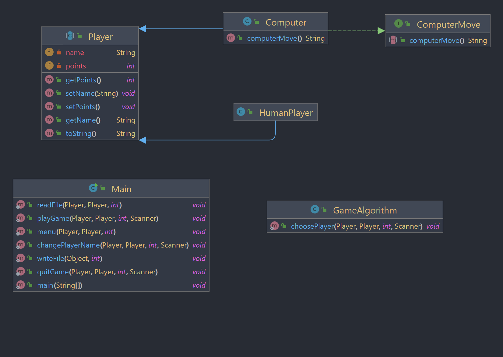

# Rock Paper Scissors

Living life as a one-player is sometimes dull and lacks adventure. With this Java-powered Rock Paper Scissors game, you can now

### Table Of Contents
- [Technologies](#technologies)
- [Snapshots](#snapshots)
- [Diagram](#diagram)
- [Game Screen](#game-screen)
- [Features](#features)
- [Behind The Scenes](#behind-the-scenes)
- [Future](#future)
- [Acknowledgements](#acknowledgements)

# Technologies

The game is built to simply run on the terminal without requiring all sorts of fancy GUI. Simply clone the project and run the file, and use your terminal to navigate through 
the game!

- 100% Java

To run, use an IDE of your choice that can execute the Java Virtual Environment (JVM). Once the terminal is running, Mmrk your selection by choosing between writing the entire 
word or the initial for each input.

## *Snapshots*

## Diagram
The relationships for each class and interface



# Game Screen
Each turn the terminal will display the updated points and metadata such as the player's name and player's turn. 


# Closing Results
When the game is closed, the final results will be printed on the terminal.


# Features

Is it really a game if you can't play it? The Tic-Tac-Toe game offers a variety of features to make your experience more enjoyable

- Game
  - Play against another player
  - Play against the AI
  - Update any player's name
      - Each player can change their name using alphanumeric characters or symbols

- History
    - An external file saves game data such as player's names, wins, ties, and date of game session
    - Review the history of the entire game data showing the latest three records

Look through the [kanban](https://github.com/users/dayjyun/projects/2) for a more in depth list of features

# Behind The Scenes

### Recognizing Who Is Player 2
- In the game implementation, there are two types of players that inherit from a Parent class: Computer and HumanPlayer. One single method is used for starting the game that 
  takes in parameters such as the player types and metadata. However, when dealing with child classes as parameters, we can run into conflicts with the argument data types. For 
  example, suppose we pass a HumanPlayer instance as Player Two in the game. In that case, we can't pass a Computer instance as Player Two since it would result in a data type 
  conflict. To avoid these conflicts and keep the code DRY (Don't Repeat Yourself), we need to verify the identity of Player Two before initiating the game. The following code block demonstrates how to perform this verification by checking the type of the Player Two instance.

```
if (playerTwo instanceof Computer) {
    playerTwoMove = ((Computer) playerTwo).computerMove();
    System.out.println('\n' + playerTwo.getName() + "'s turn" + '\n');
} else {
    System.out.println('\n' + playerTwo.getName() + "'s turn");
    playerTwoMove = playerTwoInput.nextLine().toLowerCase().trim();
}
```
### Smart AI

- A simple random number generator that will return the value of the array at the given index. Useful for the absence of our second player. 

```
public String computerMove() {
    String[] correctInput = {"rock", "scissors", "paper"};
    int randomIndex = new Random().nextInt(correctInput.length);
    return correctInput[randomIndex];
  }
}
```

## Future
The mind of a creator is always thinking of ways improve their creations.
- [ ] Hide Player Choice when against another Player
- [ ] Incorporate sounds during each turn, input, and winner
- [ ] Include a video-like element on the terminal for game instructions

## Acknowledgements
A special thanks to [Dominique Akers](https://github.com/Dommy99), [Kim Nguyen](https://github.com/knnguyen2410), and [Jaime Padilla](https://github.com/Jaypad07) during 
development for bouncing ideas and collaboration.
